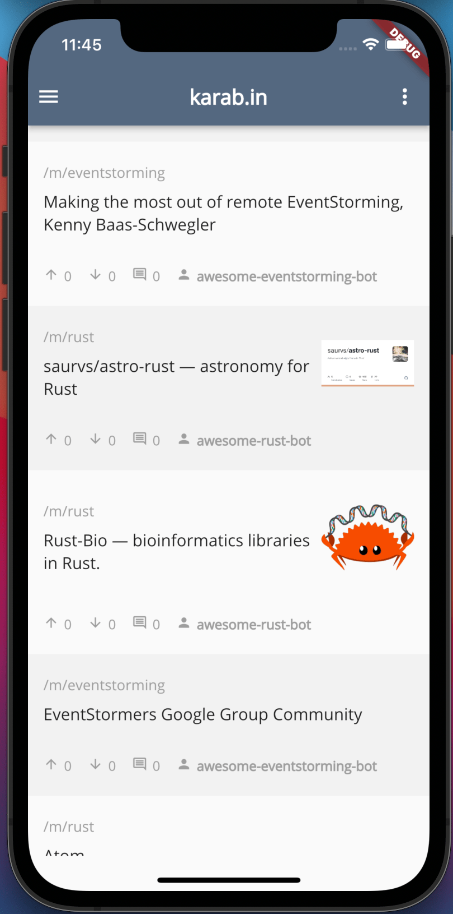
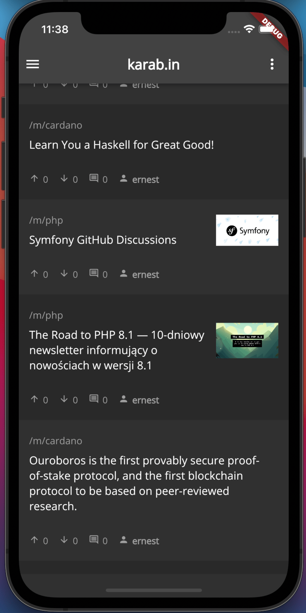
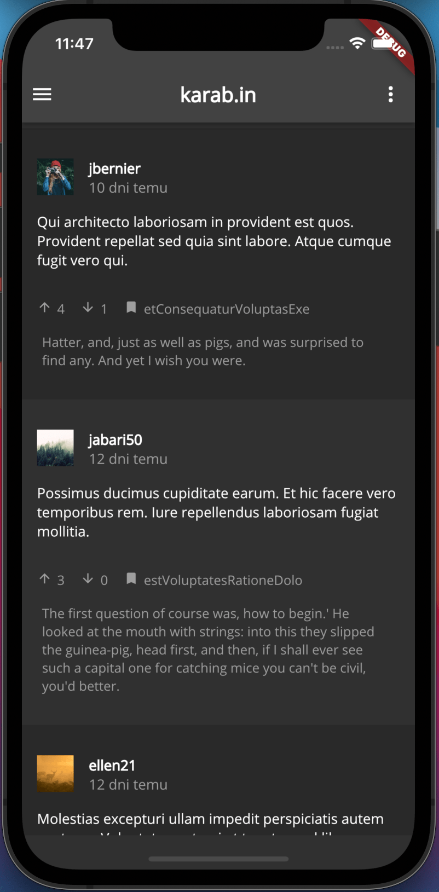
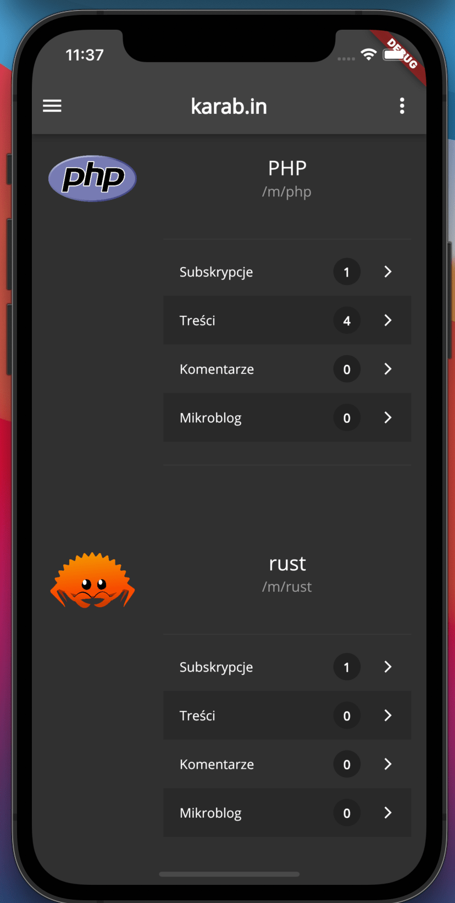

# Kbin-mobile

Kbin mobile client based on Flutter and Dart.

Kbin is a reddit-like content aggregator and micro-blogging platform for the fediverse.

This is a very early beta version, and a lot of features are currently broken or in active development, such as federation.

|     |     |     |     |     |
| --- | --- | --- | --- | --- |
  |    |    |    |  

* https://kbin.info - project website
* https://kbin.pub - main instance
* https://karab.in - polish-lang instance
* https://dev.karab.in - instance for testing purposes only

---

* [kbin-core](https://github.com/ernestwisniewski/kbin) (Symfony / PHP)
* [kbin-js-client](https://github.com/ernestwisniewski/kbin-js-client) (TypeScript)

## Getting Started

https://flutter.dev/docs/get-started/install

```bash
# Clone this repository
$ git clone https://github.com/ernestwisniewski/kbin-mobile

# Go into the repository
$ cd kbin-mobile

# Install dependencies
$ flutter packages get

# Run the app
$ flutter run
```

## Documentation

https://docs.kbin.info - Kbin API Reference

## Contributing

## License
